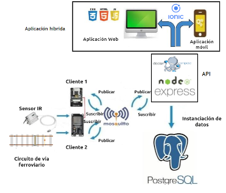

# DETECTOR DE EJES CALIENTES PARA MATERIAL RODANTE - MIoT - FIUBA

---

Autor: FS - 2021

## TABLA DE CONTENIDO

---

1. [Introduccion general](#Introduccion)
2. [Arquitectura del HBD](#Arquitectura)
3. [Organización del proyecto](#Organizacion)
4. [Como ejecutar la aplicacion](#Aplicacion)
5. [Licencia](#Licencia)
6. [Agradecimientos](#Agradecimientos)

## Introducción general

El prototipo aquí propuesto busca medir libre de contacto la temperatura de las cajas de punta de eje del material rodante. Para tal fin, se parte del trabajo desarrollado durante la Especialización en Sistemas Embebidos donde se desarrolló un prototipo de un Detector de Ejes Calientes empleando herramientas como MQTT, Node Red y el administrador de base de datos MySQL.

En esta segunda etapa a través de los conocimientos que fueron adquiridos durante la cursada en Internet de las Cosas se implementaron mejoras del prototipo HBD. Dentro de las mejoras realizadas se encuentran:

Aplicación híbrida: permite visualizar los parámetros medidos.
API REST: responde a las peticiones realizadas por el usuario.
PostgreSQL: motor de base de datos manejado por la empresa Trenes Argentinos.
Docker: se implementaron los diferentes sistemas empleando el contenedor docker

## Arquitectura del HBD

Las mejoras desarrolladas permiten al prototipo integrarse con los sistemas y/o programas que actualmente posee la empresa SOFSE. La nueva arquitectura se puede observar en la figura 1.

<p align="center">
    <br>
    <b>Figura 1</b>. Arquitectura HBD con aplicaciones Web y móvil.
</p>

Los elementos que integran el prototipo se indican a continuación:

1. Cliente 2: una que vez el material rodante es detectado por el circuito de vía, que envía una señal en alto a la placa de desarrollo ESP32 WROOM, se activa una interrupción dando inicio a la lectura de datos a través del ADC (conversor analógico digital, por sus siglas en inglés). Los datos leídos cada 9 ms son publicados con el tópico esp32/temperature con QoS 1. Adicionalmente, las temperaturas son almacenadas en una microSD card e instanciadas en la base de datos a través de una API REST. Los resultados medidos son comparados con un valor umbral preestablecido. En caso de detectar cualquier valor superior al umbral, es activada una alarma, se envía una señal en alto al cliente 1 y los datos son almacenados en la base de datos.
2. Cliente 1: una vez recibida la señal por parte del cliente 2, se activa la cámara y se toma la fotografía del material rodante que se encuentre circulando en ese momento.
3. Sensor infrarrojo IR: realiza la lectura de temperatura de la caja de punta de ejes.
4. _Broker_ mosquitto: permite la comunicación entre los clientes 1 y 2 y la API REST.
5. API REST: permite la comunicación de las diferentes aplicaciones del software siguiendo los principios REST (del inglés _Representational State Transfer_).
6. Base de datos PostgreSQL: base de datos relacional que almacena las lecturas de temperatura efectuadas por el sensor IR.
7. Aplicación híbrida: desarrollada empleando el framework ionic, permite tanto el despliegue web como móvil.

### Organización del proyecto

El proyecto se encuentra conformado por la siguiente estructura de directorios y archivos (los más relevantes a la aplicación):

```bash
   ├── nodo-central                        # Directorio raíz de la aplicación del servidor web
   │   ├── back-end                        # Directorio para el backend de la aplicación del servidor web
   │   │   ├── PostgreSql                  # Directorio para los archivos de la base de datos
   │   │   │   ├── db                      # Directorio para configuración y datos de la base de datos
   │   │   │        ├── data               # Estructura y datos de la BD.
   │   │   │        └── dumps              # Directorio de estructuras de la BD
   │   │   │
   │   │   ├── mqtt-broker                 # Directorio para el servicio MQTT
   │   │   │   ├── broker                  # Directorio para los archivos del broker MQTT
   │   │   │   └── index.js                # Código base del servidor de Express
   │   │   └──docker-compose.yml           # Archivo YAML de Docker
   │   │
   │   └── front-end                       # Directorio para el frontend de la aplicación del servidor web
   ├── esp32                               # Directorio raíz del módulo de medición de temperaturas
   ├── esp32-cam                           # Directorio raíz de módulo con cámara fotográfica
   ├── README.md                           # Archivo actual
   └── doc                                 # Documentación general del proyecto

```

## Como ejecutar la aplicación

## LICENCIA

Este proyecto se encuentra publicado bajo la licencia MIT. En [este enlace](https://opensource.org/licenses/MIT) podrá encontrar más información sobre la misma.

